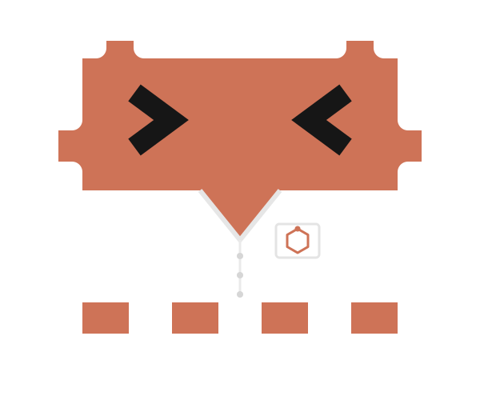

<p align="center">
  
</p>

<h1 align="center">Stanza</h1>

<p align="center">
  A structure-based, resistance-aware pipeline that designs and screens small molecules
  against covalent and steric resistance mutations.
</p>

---

## What it is

Stanza is a drug-design loop that treats a **resistance mutation** as a first-class
input. You give it a protein target (by UniProt accession) and a point mutation, typed
directly or **lifted from a paper**: upload a PDF and Claude reads it into a curated site
you confirm field by field, every field shown beside the sentence it came from (see
[Curating a site from a paper](#curating-a-site-from-a-paper)). It rebuilds the mutant
pocket from an experimental structure, asks Claude for candidate molecules conditioned on
that pocket, docks each candidate into a **matched wild-type / mutant structure pair**, and
ranks the results.

The backend is Go (Gin, `:8080`). Cheminformatics and structural biology run in Python
helpers (`scripts/`) that the Go services shell out to: RDKit, PDBFixer/OpenMM, OpenBabel,
fpocket, and AutoDock Vina. The frontend is React + TypeScript + Vite with Mol\* structure
viewers (`app/`). Persistence is Postgres via embedded, ordered SQL migrations
(`store/migrations/`); without a database the server falls back to in-memory runs.

The reference target is **KRAS G12C**. The interesting part of Stanza is what it does
*not* claim about it.

## In thirty seconds

**What it is:** a warhead-reach triage filter with auditable error bars. Not a selectivity
predictor, not an affinity predictor, not a drug-discovery engine.

**What it can claim:** *"Of the molecules proposed, these carry a cysteine-reactive warhead
that, in a rigid-receptor dock of the sotorasib-opened switch-II pocket, can reach the Cys12
thiol within van der Waals contact **and** along a Bürgi–Dunitz trajectory that permits
nucleophilic attack, from a pose the receptor actually holds."* Every number behind that
sentence (reach, angle, contributing Vina mode, seed-to-seed spread) is inspectable.

**What it cannot claim:** a binding affinity, a covalent selectivity, or a rank order among
covalent binders. That last one is kinetic, and feasibility is blind to it.

### Validated against a known answer

`selectivity` is structurally ≈0 on KRAS G12C, because the mutation's advantage is covalent
rather than shape-based, so that target can never show the dual-track machinery works.
**BCR-ABL T315I is the complementary case:** a *steric* resistance mutation, two real drugs,
and an answer known in advance. The pass criteria were fixed before the docks finished.

| | WT | T315I | selectivity | expected |
|---|---|---|---|---|
| **imatinib** | -12.59 | -12.24 | **-0.35**, defeated | negative (loses ~1000x) |
| **ponatinib** | -11.58 | -12.03 | **+0.45**, survives | ≈ 0 (designed to tolerate it) |

Separation is **0.80 kcal/mol** against **0.13** of seed noise, roughly 6x. Imatinib redocks
to its 1IEP crystal pose at **1.07 Å** (symmetry-corrected), so the setup is sound
independently of the resistance question. **PASS**, on a target the pipeline was never tuned
for.

**And the magnitude is wrong.** Experiment puts imatinib's penalty at ~4 kcal/mol; we recover
0.35, under a tenth. T315I resists only partly by steric bulk. Much of it is destabilising the
DFG-out conformation imatinib requires, and a dock into one frozen frame is architecturally
blind to that. Right answer, right reason, wrong size: trust the sign and the ordering, never
the number. The method, the caveats, and the metric that flattered the pose by 1.8x are in
[`docs/features/11-abl-t315i-positive-control.md`](docs/features/11-abl-t315i-positive-control.md).

**Four places this project proved its own headline numbers wrong.** The detail is in
[Limitations](#limitations--roadmap), and it is the reason to trust the rest.

| # | The claim | What measurement showed |
|---|---|---|
| 1 | Covalent selectivity is worth **+2.2 kcal/mol** | It was a *constant* wearing an energy's units. Since WT and mutant bind alike non-covalently, `selectivity = wt - (mut - credit)` collapsed to `selectivity = credit`. Deleted end to end; covalent evidence is now a dimensionless feasibility ∈ [0,1] reported *beside* the affinity. |
| 2 | The generator produces **novel molecules** | It produces novel *scaffolds*. 41/41 pass, zero Murcko collisions, max Tanimoto 0.485. But a Murcko scaffold strips side chains, so it strips the warhead. 80% carry the same N-acyl saturated N-heterocycle all five reference drugs carry. The honest claim is **"novel scaffolds bearing conventional warhead chemistry."** (Aspirin also scores `novel_scaffold`, at Tanimoto 0.097, and cannot reach Cys12.) |
| 3 | **`feasibility = 1.00`** means the warhead can bond | On 4 of 5 molecules, the stronger check disagrees. Building the actual covalent adduct succeeds for exactly **one** molecule, the one scoring **0.10**. The molecule scoring 1.00 clashes worst, at 1.32 Å. This is a **live, unfixed defect** in a term carrying 0.40 of the fitness weight. It is surfaced, not folded in. |
| 4 | The **median over seeds** controls docking noise | It creates it. A molecule read selectivity **+2.39** against a mutation that cannot change reversible binding; seven seeds showed both tracks bimodal, with the wild type finding its deep pose in **1 seed of 7**. True margin: **+0.19**. Vina is a minimiser, so the deepest pose is the estimate and a low outlier is the *answer*, not noise. Now best-of-seeds, with each track's spread published as the error bar, and any margin below its own spread labelled **not resolved**. |

And one more, caught in our own test suite: the SMILES for sotorasib, adagrasib and ARS-1620
that guarded the pre-filter were **hand-typed fabrications**, plausible molecules that were
not those drugs, masses off by 28-109 Da. The test passed anyway. Reference structures now
load from `data/prior_art_kras_g12c.json`, by PubChem CID. See [Testing](#testing).

## The covalent-selectivity insight

Read this before trusting any number Stanza prints.

KRAS G12C's selectivity is **covalent**, not shape-based. A drug slides into the switch-II
pocket of wild-type and mutant KRAS with essentially identical *reversible* affinity:
pan-KRAS binders engage WT, G12C, G12D, G12V and G13D at Kd ≈ 10-40 nM, and adagrasib itself
binds wild-type KRAS tightly and non-covalently. What the mutant alone offers is a **Cys12
thiol** for the warhead to bond. AutoDock Vina scores *non-covalently* and is blind to that
bond.

Two consequences shape the whole design.

**1. `selectivity = wt_score - mutant_score` is the honest non-covalent margin, and for a
covalent target it is uninformative.** That is the correct answer, not a bug. Gly12→Cys12
barely perturbs the reversible contact set, so the two tracks usually agree to within
~0.1 kcal/mol. Non-covalent docking cannot separate them on the mechanism that matters.

It is *uninformative*, not *zero*. Across seven in-window molecules docked into 6OIM, the
margin ran from -0.83 to +0.30 kcal/mol (median +0.08). But those docks used the old
median-over-seeds estimator and have not been re-run, so the tails of that range are not
trustworthy: the same estimator manufactured a +2.39 on an eighth molecule whose two pockets
agree to 0.19 kcal/mol (see [Determinism](#determinism-and-noise-control)). Treat the ≈0
centre as the claim and the tails as unmeasured.

Where a margin *is* real, it reports sterics. The Cys12 side chain shrinks the pocket by
~48 ų (fpocket, Δvolume), so a ligand that fills it can genuinely prefer wild-type. A large
`|selectivity|` therefore reports **steric fit**, never covalent discrimination. Reading it as
the latter is the exact error the removed "covalent credit" institutionalised. A margin
smaller than its own seed spread reports neither, and the board says so.

**2. The covalent signal is a dimensionless feasibility ∈ [0,1], reported *beside* the
affinity and never folded into it.** It is measured from the docked geometry
(`scripts/covalent.py`):

```
feasibility = distance_score × angle_score
```

| Term | Full credit | Zero credit | Grounding |
|---|---|---|---|
| `distance_score` | reach ≤ **3.50 Å** | reach ≥ **4.00 Å** | 3.50 Å is the Bondi S···C van der Waals contact (C 1.70 + S 1.80); 4.00 Å is the published covalent-competence line |
| `angle_score` | within **±15°** of ideal | beyond **±40°** | ideal is **105°** (Bürgi–Dunitz, sp2 Michael acceptor) or **180°** (SN2 backside attack on a haloacetamide) |

Only Vina modes within **2.0 kcal/mol** of the best mode may contribute geometry, so a floppy
ligand cannot buy reach with a pose the receptor never actually holds. `reach` is the
**median** warhead-carbon to Cys12-SG distance across replicate docking seeds.

An earlier version added a constant **4.0 kcal/mol "covalent credit"** to the mutant score. It
was removed, end to end. Covalent potency is **kinetic** (`kinact/KI`, spanning ~76 to
~35,000 M⁻¹s⁻¹ from ARS-853 to adagrasib), and wild-type Gly12 has no thiol at all, so the
discrimination is *unbounded*, not a few kcal/mol. Expressing it in kcal/mol was a category
error, and a single constant cannot rank binders that span two orders of magnitude in
efficiency. `models.CovalentDock` now carries **no energy**, only the feasibility and the
geometry that produced it.

## How it works

Seven stages, run per resistance run:

1. **Structure acquisition.** An experimental holo → apo ladder (with residue verification),
   falling back to AlphaFold. `services/structure_acquisition.go`.
2. **Mutagenesis.** Builds a matched WT/mutant pair from **one** base structure so both tracks
   share a backbone frame. Exactly one side chain is rebuilt; missing loops are deliberately
   not modelled. `scripts/mutate.py` (PDBFixer), `services/mutagenesis.go`.
3. **Pocket analysis.** fpocket on both tracks, plus the WT→mutant delta. `services/fpocket.go`,
   `services/mutation_pockets.go`.
4. **Dual-track docking.** AutoDock Vina into both pockets over shared box and seeds.
   `services/dual_dock.go`.
5. **RDKit validation.** Parse, canonicalize, dedupe (run-scoped by InChIKey), and a
   drug-likeness pre-filter (MW, QED, Rule-of-Five, optional synthetic accessibility) before
   spending the docking budget. A curated site widens the gate to the weight window it
   declares. `scripts/validate.py`, `services/validation.go`.
6. **Generation.** Claude proposes SMILES via a tool call, conditioned on the pocket context,
   the WT→mutant delta, curated site guidance, and the scored history of what has already been
   docked. `services/generation.go`.
7. **Selectivity scoring and ranking.** A composite fitness over four normalised terms.
   `scoring/selectivity.go`.

**The loop closes.** Every molecule you dock is fed back into the next generation round,
ranked by which warhead actually reached the cysteine, so Claude designs the next batch
against measured geometry rather than a blank pocket, and against the molecules it has already
been shown not to repeat.

That history is not limited to Claude's own output. A **"Fetch from ChEMBL"** control pulls
known compounds sized to the resistance pocket, and any you dock enter the same history. So
you can hand the generator a *proven* binder to anchor on, not only its own attempts. This
also serves as a control: docking a published inhibitor through the identical dual-track and
covalent pipeline shows whether the geometry gate is calibrated, by putting a molecule with a
known answer next to the novel scaffolds on one ruler. The reference molecules bypass the
430-620 Da generation gate on purpose; that gate steers what Claude proposes, not what a human
docks as a reference.

### The reference target is curated, not derived

KRAS G12C is built on **PDB 6OIM** (sotorasib covalently bound to Cys12), *not* the AlphaFold
model. The switch-II pocket is **cryptic**: it only opens around a bound inhibitor and is
absent from apo and AlphaFold structures, where the drug docks weaker and leaves the warhead
beyond bonding range. This is curated in `services/known_sites.go` as a `SiteTemplate` (which
structure to build the pair on) plus a `SiteGuidance` (the covalent mechanism, the
His95/Tyr96/Gln99 pharmacophore, a 430-620 Da weight window, and the prior art the generator
must not simply re-derive).

The weight window reaches the drug-likeness pre-filter as well as the prompt. It has to.
Lipinski's rule of five is a heuristic for oral absorption, not a law, and this pocket is only
addressable by molecules that break it. Under the default 500 Da ceiling the pre-filter
discards **sotorasib (560.6 Da) and adagrasib (604.1 Da)**, the two marketed switch-II drugs,
and adagrasib fails the QED floor besides. A filter that drops the approved drug cannot judge a
molecule designed to resemble it.

### Curating a site from a paper

A curated site does not have to be hand-written. Upload a paper as a PDF and Claude reads the
whole document and drafts the same fields a hand-curated target carries: the target identity,
the reactive residue, the pocket, any molecular-weight window, and the prior art. What makes
the draft usable rather than a guess is the provenance. **Every field is presented beside the
verbatim sentence it was drawn from**, and a field the paper does not state is marked *not found
in paper* rather than invented. A person confirms or corrects each field before it drives
anything, so an extracted number that will condition docking, generation and the weight gate is
ratified against the source first.

The load-bearing case is that the reactive residue is **not** always the mutation site. A
resistance mutation can remove the very residue an earlier drug bonded, and the design then
targets a different one. For **EGFR C797S** the mutation destroys the cysteine osimertinib bonds
(Cys797), so a covalent design instead targets a native cysteine deeper in the pocket (Cys775).
The confirmed site records that residue, and the generator is briefed to place a warhead that
can reach it, not the mutation site by reflex.

A confirmed site becomes a runtime `KnownSite`, the same structure the hand-curated targets use
(`services/site_registry.go`), and is consulted ahead of the built-in registry for its exact
accession and mutation. It supplies the structure to build the wild-type / mutant pair on and the
guidance that steers generation, exactly as a hand-written entry does.

A full worked example, ingesting the EGFR C797S paper and following it through the mutant build,
generation and ranking, is in
[`jm5c02924-walkthrough.md`](jm5c02924-walkthrough.md).

### Determinism and noise control

- **Ligand conformers** are generated by RDKit ETKDG under a fixed seed (`scripts/ligprep.py`).
  `obabel --gen3d` is unseeded and returned a different structure every call, which mattered for
  the covalent reach distance.
- **Both tracks are docked under the same replicate seeds** (`{42, 1337, 7}`, three), and every
  reported affinity is the **deepest pose any seed found**, published with that track's
  seed-to-seed spread as its error bar. Replicates run concurrently in a bounded pool.

  This was a median until a molecule read selectivity **+2.39** against a mutation that cannot
  change reversible binding. Seven seeds per track explained it: both tracks were bimodal, the
  mutant found its deep basin (≈ -9.35) in 5 seeds of 7, the wild type found its own (-9.23) in
  **1 of 7**. The pockets bind that ligand to within **0.19 kcal/mol**. The median reported
  whichever basin the search preferred, and manufactured 2.2 kcal/mol of selectivity out of
  sampling asymmetry between two tracks that were never equally searchable. Across all 35
  three-seed subsets the median answer ranged +0.21 to +2.34.

  Vina is a **minimiser**: its affinity estimates a global minimum, so a low outlier is not
  noise to be resisted, it is the best available estimate of the answer. A minimum still
  discards the *shallow* outlier that produced the original phantom +1.03 (a shallow pose is
  never the deepest one), so best-of-seeds fixes that case too. It is downward-biased with more
  seeds, and that bias only cancels in `wt - mut` when both tracks are equally searchable, which
  is exactly what failed here. So the spread travels with the score, and a margin smaller than
  its own spread is labelled **not resolved** rather than reported as a finding.
- **Exhaustiveness is 16**, twice Vina's default. At 8 the search is *bimodal* on some ligands:
  it finds either a deep pose with the warhead 5.8 Å from the thiol or a shallower one at
  3.85 Å, and the covalent verdict follows whichever it found. Seeds cannot fix that; they
  resample the same two basins. Vina is bit-deterministic given (seed, cpu, box, ligand), so
  this is basin selection, not RNG.

  Raising exhaustiveness **narrows** the problem; it does not remove it. On two measured ligands
  it took one from a straddling verdict to a stable one and cut the other's flip-prone
  three-seed subsets from 3-in-10 to 0-in-10. Others still show a reach spread of several
  ångström at 16. For those, the answer is `uncertain`, and that is the correct answer.
- A molecule whose covalent call **flips with the docking seed** is flagged `uncertain`,
  surfaced to the user, and contributes **0** to fitness. Ranking a coin flip on its median
  would launder noise into signal. It is the backstop for ligands whose search stays genuinely
  bimodal, and it fires in practice, not just in principle.
- The docking box reaches Vina at three decimal places. For a ligand with a bimodal search that
  quantisation is not cosmetic: it selects a basin.

### Fitness

The leaderboard fitness (`scoring/selectivity.go`) is a weighted sum of four pool-normalised
terms. The default split is tuned for a covalent target:

| Term | Weight | Note |
|---|---|---|
| Covalent feasibility | 0.40 | the only covalent evidence a docked pose yields |
| Mutant potency (-mutant_score) | 0.30 | next-best discriminator |
| Drug-likeness (QED) | 0.20 | keeps the board drug-like |
| Non-covalent selectivity | 0.10 | ≈ 0 for a covalent target; down-weighted, not dropped, so genuinely non-covalent runs still use it |

For a run with no covalent molecules the feasibility term normalises to zero and drops out
automatically; the pool then ranks exactly as the pre-covalent scorer did.

## What Stanza can and cannot claim

**It can claim:** *"Of the molecules proposed, these carry a cysteine-reactive warhead that, in
a rigid-receptor dock of the sotorasib-opened switch-II pocket, can reach the Cys12 thiol within
van der Waals contact **and** along a Bürgi–Dunitz trajectory that permits nucleophilic attack,
from a pose the receptor actually binds."* That is a reproducible, unit-honest triage filter
whose reach, angle, contributing mode and seed-to-seed spread are all auditable.

It can also claim, now measured rather than assumed, that the steered generator **produces novel
scaffolds inside the declared 430-620 Da window, and that most of them clear the geometry gate**:
7/7 novel, 5/7 feasible, 1 correctly rejected at 4.52 Å reach, 1 correctly flagged seed-dependent
(2.77 Å spread across seeds).

And on a **steric** resistance mutation, where `selectivity` is a physically meaningful quantity
rather than a structural zero, it can claim the machinery **picks the right drug**: imatinib
-0.35 (defeated by ABL T315I), ponatinib +0.45 (survives it), separation 0.80 kcal/mol against
0.13 of seed noise, after redocking imatinib to its crystal pose at 1.07 Å. The *sign and the
ordering* are trustworthy. The *magnitude* is not: we recover 0.35 of an experimental
~4 kcal/mol, because a rigid DFG-out receptor cannot represent the conformational component of
T315I resistance.

**It cannot claim** a binding affinity, a selectivity (the reported `selectivity` is the raw
non-covalent margin; when it is large it reports steric fit, not covalent discrimination), a rank
order among covalent binders (that is kinetic and feasibility is blind to it), or that one
molecule is a better G12C inhibitor than another. It cannot yet claim that a high-feasibility
molecule forms a *buildable* covalent adduct: on the evidence so far, the correlation runs the
wrong way.

Stanza is a **warhead-reach filter, not a selectivity predictor.**

## Testing

```bash
go test ./...           # Go unit tests (services, scoring, …)
```

Tests do not launch Vina, fpocket or OpenBabel; the docking stages are exercised end-to-end only
against a real toolchain.

Reference structures are **read from `data/prior_art_kras_g12c.json`, never typed into a test.**
An earlier revision hand-wrote SMILES for sotorasib, adagrasib and ARS-1620; all three were
plausible-looking molecules that were not those drugs, with wrong InChIKey skeletons and masses
off by 28-109 Da. The pre-filter test built on them passed, because invented molecules of roughly
the right size behave roughly the right way. The structures in the data file carry their PubChem
CIDs; re-fetch them, do not retype them.

Novelty is audited out-of-band, not in the pipeline:

```bash
echo '{"query":[{"id":"m1","smiles":"..."}]}' | python3 scripts/novelty.py
```

The ABL T315I positive control is reproducible from a clean checkout. It fetches the structure,
builds the matched pair, derives the box from the crystal ligand, and runs the 12 docks. Nothing
is hand-entered, and Vina is deterministic given (seed, cpu, box, ligand), so the numbers
reproduce bit-for-bit:

```bash
scripts/controls/abl_t315i.sh            # ~8 min, needs vina + obabel + RDKit/PDBFixer
```

## Limitations & roadmap

- **Feasibility is measured from a *free* dock.** Vina has no reason to aim the warhead at the
  thiol. The measurement is reproducible; the method is not rigorous. Genuine covalent docking
  (form the bond, search under the constraint, rescore the adduct) is **not implemented**.
- **Raw Vina affinities of -8 to -10 kcal/mol are optimistic.** Real reversible switch-II binding
  is weak (ARS-853 Ki ≈ 200 µM; adagrasib's reversible Ki ≈ 3.7 µM is the ceiling for an
  optimized drug). Rigid-receptor docking into a pocket a real drug pried open pays no
  reorganization penalty. A Vina score here is a *"fits the pocket"* signal, not a binding free
  energy.
- **Novelty is now measured, and the novelty is real, but it lives in the ring system, not the
  warhead.** `scripts/novelty.py` scores every molecule against the five published switch-II
  inhibitors (`data/prior_art_kras_g12c.json`, structures fetched from PubChem by CID). Across the
  41 KRAS molecules generated so far: **41/41 novel scaffold**, zero exact or generic
  Bemis–Murcko collisions, 32 distinct frameworks, max ECFP4 Tanimoto **0.485** against any
  reference (median 0.278), nothing near the 0.70 analogue line.

  That headline overstates it, because a Murcko scaffold strips side chains and therefore strips
  the warhead. Measured directly, **80%** carry an N-acyl saturated N-heterocycle (5/5 references
  do) and **50%** carry an acyl-piperazine on an arene (4/5 do). The model conserves the
  warhead-delivery module and innovates on the ring system it hangs from, which is what the prompt
  asks for and what a medicinal chemist would do. The defensible claim is *"novel scaffolds
  bearing conventional warhead chemistry,"* not *"novel molecules."* Novelty is also **orthogonal
  to feasibility**: aspirin scores `novel_scaffold` at Tanimoto 0.097 and cannot reach Cys12.

- **The tether check contradicts the feasibility score, and the score ignores it.** After
  measuring geometry, `covalent.py` tries to *build* the covalent adduct: bond S to the warhead
  carbon, MMFF-minimise with the cysteine backbone fixed, then verify the S–C bond closed to
  1.81 ± 0.25 Å and that no ligand heavy atom sits within 2.0 Å of the receptor. Of the seven
  in-window molecules docked, five clear the geometry gate, and **only one produces a buildable
  adduct.** The other four clash (1.32-1.82 Å). The molecule scoring a perfect `feasibility = 1.00`
  clashes *worst*; the one that tethers cleanly (S–C 1.89 Å) scores **0.10**.

  A tempting explanation is that a short reach is *too* close: closing to a 1.81 Å bond from
  3.31 Å drags the ligand into the pocket wall, while a 3.94 Å pose has room to rotate in. **The
  data do not support asserting that.** Reach versus minimum contact gives Spearman ρ = 0.70 over
  n = 5 (exact permutation p = 0.12), and the relationship is not even monotonic: reach 3.54 Å
  clashes at 1.82 Å while reach 3.68 Å clashes at 1.44 Å. Five ligands, five scaffolds, one
  success: reach is confounded with everything else that varies. The contradiction between the two
  checks is a **measured fact**; the mechanism behind it is an **untested hypothesis**, and
  separating those is the whole point of this section.

  `feasibility = distance_score × angle_score` never sees the tether outcome, which is recorded
  only as a `note`. So the 0.40-weight fitness term is ranked on a proxy that the stronger
  structural check disagrees with on 4 of 5 molecules. Two caveats before treating the tether as
  ground truth: the minimisation runs **in vacuum** (the receptor is not in the force field, so
  the ligand relaxes into a wall it never feels), and the receptor is **rigid** (real side chains
  flex). The disagreement is a live, unresolved defect, not a settled verdict; it is surfaced
  rather than folded in.
- **`uncertain` is a backstop, not a solution.** A ligand whose covalent call still flips with the
  seed at exhaustiveness 16 is reported as indistinguishable and excluded from the ranking. That is
  honest, but it means the tool declines to answer rather than answering correctly.
- **A rigid receptor recovers the sign of a resistance mutation, not its size.** The ABL T315I
  control gets imatinib's direction right and separates it from ponatinib by 0.80 kcal/mol, but the
  experimental penalty is ~4 kcal/mol, so we recover under a tenth of it. Resistance that works by
  shifting the protein's *conformation* (T315I destabilises the DFG-out state imatinib needs) is
  invisible to a dock into one frozen frame. The pipeline sees steric bumps. It does not see
  conformational selection, and no amount of exhaustiveness fixes that. Flexible side chains
  (`--flexres`) would recover part of it; an ensemble over conformers would recover more.

Roadmap, in priority order: resolve the feasibility/tether contradiction by minimising the adduct
with the receptor in the force field before trusting either signal, then decide whether the tether
outcome belongs *inside* the feasibility score or beside it. After that, genuine covalent docking
(gnina's covalent mode or an AutoDock4 flexible-residue protocol) with a reorganization penalty,
which would subsume both. Even purpose-built covalent docking reaches only Spearman ρ ≈ 0.54
against experimental potency, so a better docker raises the ceiling but does not make the number an
energy.

## References

Constants and claims trace to the primary literature:

- Ostrem et al. 2013, *Nature* 503:548. Switch-II pocket discovery; GDP-state trapping; warheads.
- Canon et al. 2019, *Nature* 575:217. Sotorasib (AMG 510); PDB 6OIM.
- Patricelli et al. 2016, *Cancer Discovery*. ARS-853; reversible Ki ≈ 200 µM.
- Hansen et al. 2018, *Nat Struct Mol Biol*. Reactivity-driven G12C inhibition.
- Vasta et al. 2022, *Nat Chem Biol*. Reversible switch-II engagement of **wild-type** KRAS.
- Meller et al. 2023, *JCTC*. AlphaFold does not open cryptic pockets.

The discovery campaigns of the exact control drugs, the manual structure-based design loops Stanza
automates:

- Lanman et al. 2020, *J. Med. Chem.* 63:52. Sotorasib (AMG 510); switch-II conformational locking
  to satisfy the warhead trajectory.
- Fell et al. 2020, *J. Med. Chem.* 63:6679. Adagrasib (MRTX849); reversible-affinity versus
  covalent-reactivity balance; 604 Da beyond Lipinski.
- Huang et al. 2010, *J. Med. Chem.* 53:4701. Ponatinib (AP24534); ethynyl linker designed to
  bypass the T315I gatekeeper.

The full audit, with every claim independently sourced and mapped onto the code, is in
[`docs/features/10-covalent-validity-audit.md`](docs/features/10-covalent-validity-audit.md). How
the pipeline's logic maps onto those published discovery campaigns, and what the comparison does and
does not license as a claim, is in
[`docs/features/12-medchem-campaign-comparison.md`](docs/features/12-medchem-campaign-comparison.md).

## Must reads

If you read nothing else in this repo, read these three:

- [`docs/features/11-abl-t315i-positive-control.md`](docs/features/11-abl-t315i-positive-control.md):
  the validated positive control. A steric resistance mutation where `selectivity` is a real
  quantity, two known drugs, and one known answer fixed before the docks finished. This is where the
  dual-track machinery is shown to work.
- [`docs/features/12-medchem-campaign-comparison.md`](docs/features/12-medchem-campaign-comparison.md):
  how the pipeline's logic maps onto the published discovery campaigns of the exact control drugs
  (sotorasib, adagrasib, ponatinib), and what that comparison does and does not license as a claim.
- [`jm5c02924-walkthrough.md`](jm5c02924-walkthrough.md): a full worked example, ingesting a paper
  and following it through the mutant build, generation, docking and ranking.

## License

Apache License 2.0. See [`LICENSE`](LICENSE).
