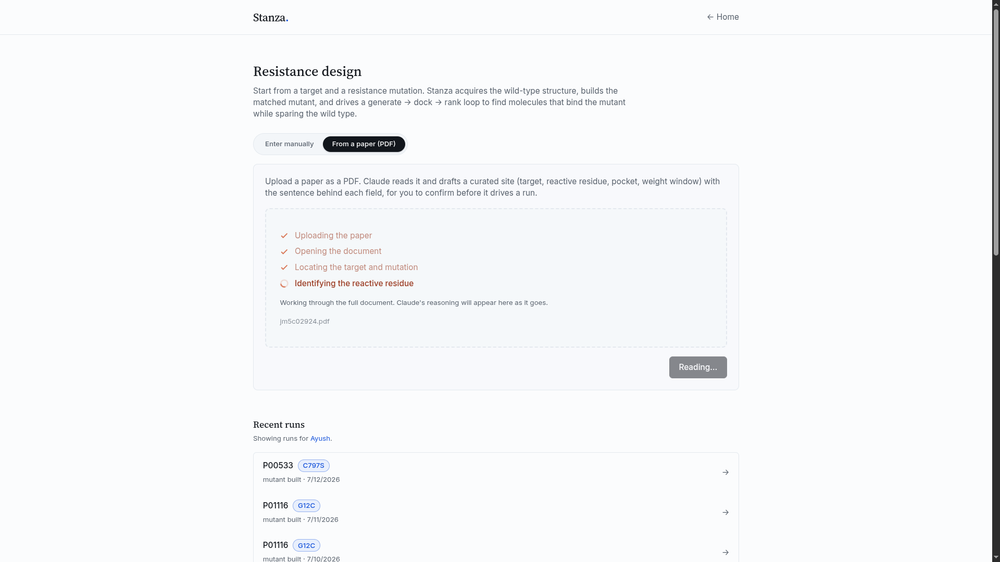
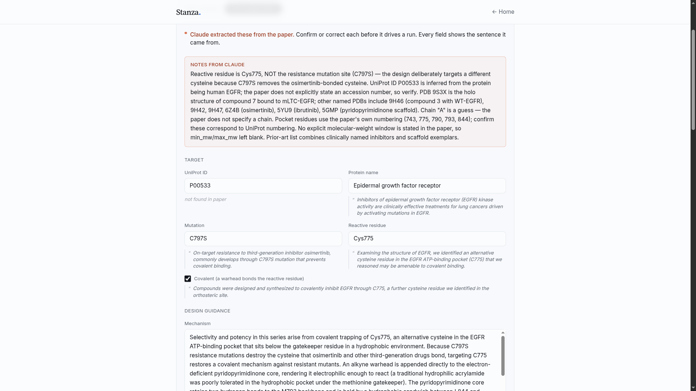
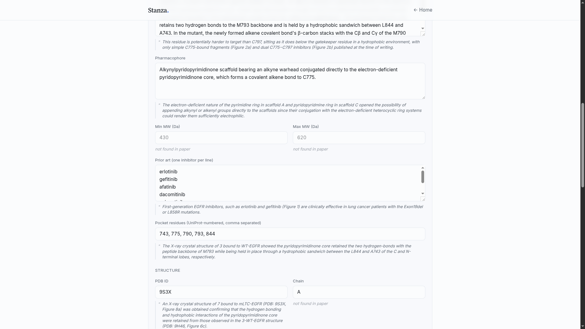
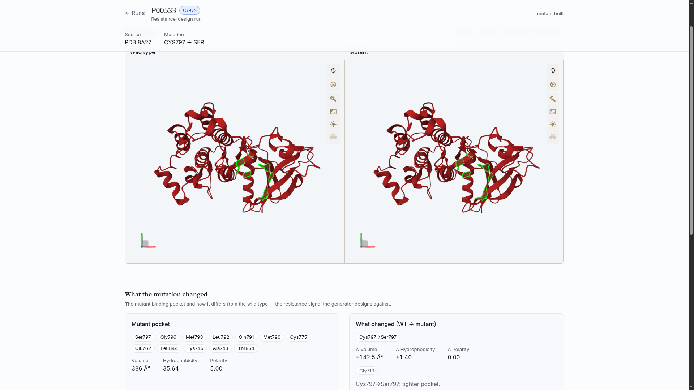
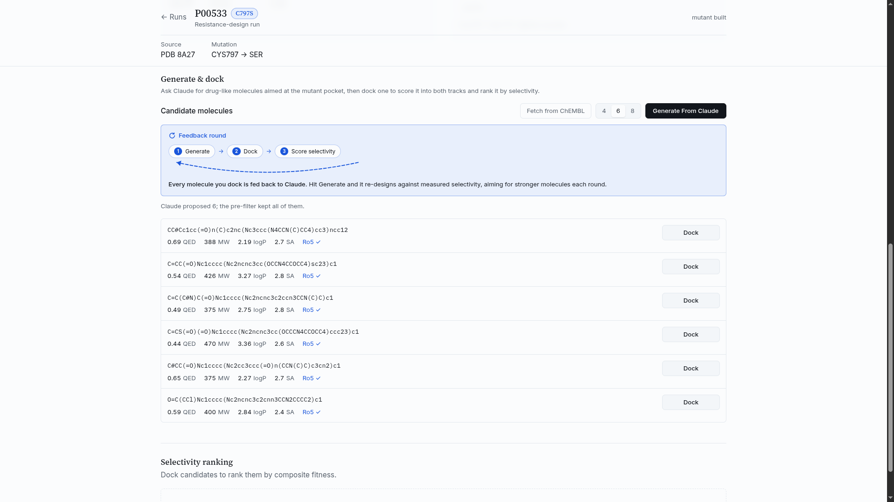
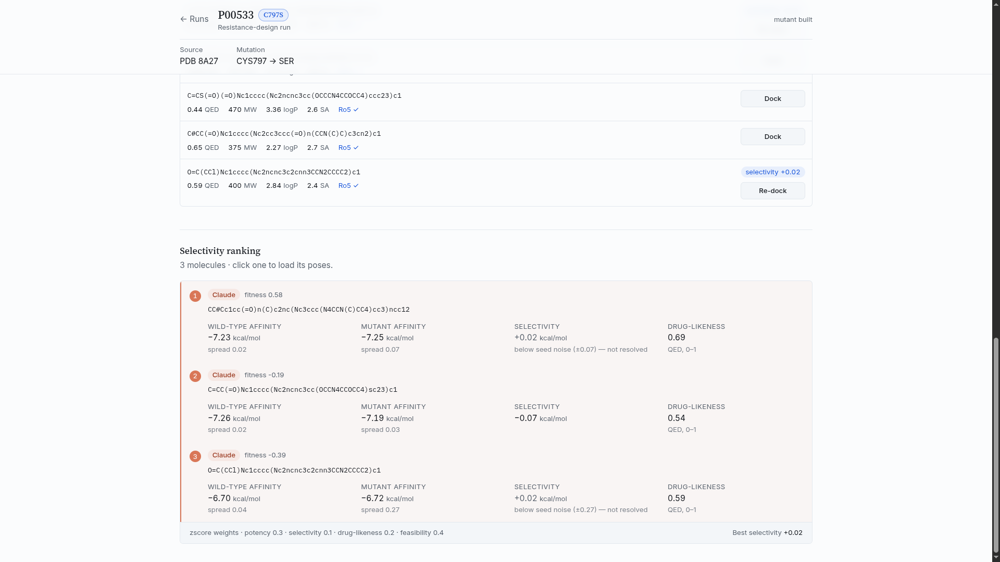

# Stanza — Pipeline Walkthrough

*A worked example: designing against EGFR C797S, ingested from a medicinal-chemistry paper.*

Stanza turns a resistance target into a ranked set of candidate molecules. You give it a protein and a resistance mutation; it acquires the wild-type structure, builds the matched mutant, and drives a **generate → dock → rank** loop to find molecules that bind the mutant while sparing the wild type. This walkthrough follows one run end to end.

The target here is **EGFR** with the **C797S** resistance mutation — the on-target mutation that defeats third-generation inhibitors like osimertinib by removing the cysteine they covalently bond. The design instead targets a *different* native cysteine in the ATP pocket, **Cys775**.

---

## 1. Ingest the target from a paper

A run can start from a typed target, or from a paper. Upload a PDF and Claude reads the full document and drafts a curated site — target, reactive residue, pocket, weight window, prior art — with the exact sentence behind each field. Its progress is shown as it works.

---

## 2. Confirm the site

Nothing drives a run until a person ratifies it. Every extracted field is shown editable **beside the verbatim sentence it came from**, so a confirmation is a check against the source text rather than an act of faith. A field the model cannot ground in the paper is marked *not found in paper* instead of being invented.

For this target the review captures the load-bearing distinction: the **reactive residue is Cys775, not the mutation site (C797S)** — because C797S removes the cysteine earlier drugs bonded, the design targets a different cysteine. The site is marked **covalent**, meaning a warhead should bond that residue.

The same review covers the **design guidance** — the mechanism, the pharmacophore, the pocket residues (UniProt-numbered), any molecular-weight window, and the prior art the generator must not simply re-derive — plus the **structure** the wild-type/mutant pair will be built on.

---

## 3. Build the matched wild-type / mutant pair

On confirmation, Stanza acquires the wild-type structure, applies the point mutation, and builds the mutant — producing two aligned structures that differ only at the mutated site. Both are shown side by side.

The panel underneath reports **what the mutation changed**: the residues lining the mutant pocket, and the wild-type → mutant delta in volume, hydrophobicity and polarity. This difference is the resistance signal the generator designs against.

---

## 4. Generate candidate molecules

Claude is asked for drug-like molecules aimed at the mutant pocket. For a covalent site, it is briefed to place a warhead that can reach the reactive residue (Cys775) on a short, direct linker, while filling the rest of the pocket. Every proposal then passes an RDKit pre-filter — drug-likeness (QED), molecular weight, logP, synthetic accessibility, and a rule-of-five check — before it is kept.

Each kept molecule is shown with its SMILES and computed properties, ready to dock.

---

## 5. Dock and rank by selectivity

Each candidate is docked into **both** tracks — the wild-type structure and the mutant — and scored. Molecules are ranked by a composite **fitness** that combines potency, wild-type-vs-mutant selectivity, drug-likeness, and covalent feasibility, with each track's per-seed spread reported so a margin is never read as real when it sits inside the docking noise.

The loop closes here: every molecule you dock is fed back to the generator, so the next **Generate** re-designs against the measured results — aiming for stronger molecules each round.

---

## The flow, in one line

**Paper → confirmed site → wild-type/mutant pair → generated candidates → dock both tracks → rank → feed back.** A number extracted from the literature drives docking, generation and the weight gate downstream, so at every step the model proposes and a person ratifies against the source.
